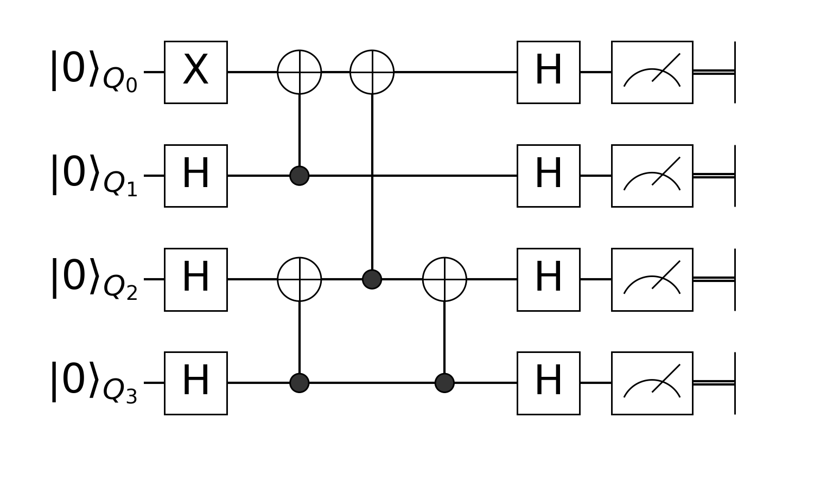
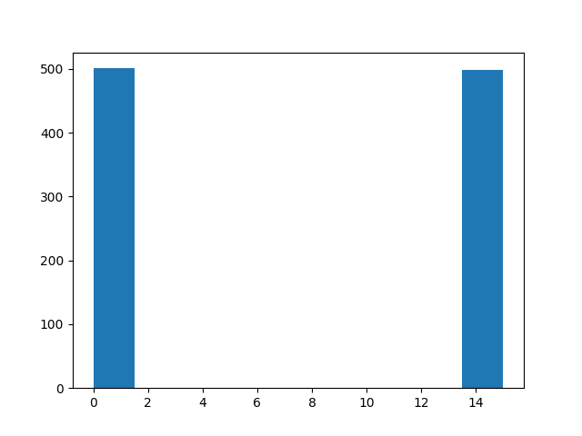

# [Prepare Greenberger–Horne–Zeilinger state with Quantum Circuit](@id example-ghz)

First, you have to use this package in Julia.

````julia
using Yao
````


Now, we just define the circuit according to the circuit image below:



````julia
circuit = chain(
    4,
    put(1=>X),
    repeat(H, 2:4),
    control(2, 1=>X),
    control(4, 3=>X),
    control(3, 1=>X),
    control(4, 3=>X),
    repeat(H, 1:4),
)
````


````
nqubits: 4
chain
├─ put on (1)
│  └─ X gate
├─ repeat on (2, 3, 4)
│  └─ H gate
├─ control(2)
│  └─ (1,) X gate
├─ control(4)
│  └─ (3,) X gate
├─ control(3)
│  └─ (1,) X gate
├─ control(4)
│  └─ (3,) X gate
└─ repeat on (1, 2, 3, 4)
   └─ H gate
````


Let me explain what happens here.

## Put single qubit gate X to location 1

we have an [`X`](@ref) gate applied to the first qubit.

We need to tell `Yao` to put this gate on the first qubit by

````julia
put(4, 1=>X)
````


````
nqubits: 4
put on (1)
└─ X gate
````


We use Julia's `Pair` to denote the gate and its location in the circuit,
for two-qubit gate, you could also use a tuple of locations:

````julia
put(4, (1, 2)=>swap(2, 1, 2))
````


````
nqubits: 4
put on (1, 2)
└─ put on (1, 2)
   └─ SWAP gate
````


But, wait, why there's no `4` in the definition above? This is because
all the functions in `Yao` that requires to input the number of qubits as its
first arguement could be lazy (curried), and let other constructors to infer the total
number of qubits later, e.g

````julia
put(1=>X)
````


````
(n -> put(n, 1 => X gate))
````


which will return a lambda that ask for a single arguement `n`.

````julia
put(1=>X)(4)
````


````
nqubits: 4
put on (1)
└─ X gate
````


## Apply the same gate on different locations

next we should put Hadmard gates on all locations except the 1st qubits.

We provide [`repeat`](@ref) to apply the same block repeatly, repeat can take an
iterator of desired locations, and like `put`, we can also leave the total number
of qubits there.

````julia
repeat(H, 2:4)
````


````
(n -> repeat(n, H gate, 2, 3, 4))
````


## Define control gates

In Yao, we could define controlled gates by feeding a gate to [`control`](@ref)

````julia
control(4, 2, 1=>X)
````


````
nqubits: 4
control(2)
└─ (1,) X gate
````


Like many others, you could leave the number of total qubits there, and infer it
later.

````julia
control(2, 1=>X)
````


````
(n -> control(n, 2, 1 => X gate))
````


## Composite each part together

This will create a [`ControlBlock`](@ref), the concept of block in Yao basically
just means quantum operators, since the quantum circuit itself is a quantum operator,
we could create a quantum circuit by composite each part of.

Here, we use [`chain`](@ref) to chain each part together, a chain of quantum operators
means to apply each operators one by one in the chain. This will create a [`ChainBlock`](@ref).

````julia
circuit = chain(
    4,
    put(1=>X),
    repeat(H, 2:4),
    control(2, 1=>X),
    control(4, 3=>X),
    control(3, 1=>X),
    control(4, 3=>X),
    repeat(H, 1:4),
)
````


````
nqubits: 4
chain
├─ put on (1)
│  └─ X gate
├─ repeat on (2, 3, 4)
│  └─ H gate
├─ control(2)
│  └─ (1,) X gate
├─ control(4)
│  └─ (3,) X gate
├─ control(3)
│  └─ (1,) X gate
├─ control(4)
│  └─ (3,) X gate
└─ repeat on (1, 2, 3, 4)
   └─ H gate
````


You can check the type of it with `typeof`

````julia
typeof(circuit)
````


````
YaoBlocks.ChainBlock{4}
````


## Construct GHZ state from 00...00

For simulation, we provide a builtin register type called [`ArrayReg`](@ref),
we will use the simulated register in this example.

First, let's create ``|00⋯00⟩``, you can create it with [`zero_state`](@ref)

````julia
zero_state(4)
````


````
ArrayReg{1, Complex{Float64}, Array...}
    active qubits: 4/4
````


Or we also provide bit string literals to create arbitrary eigen state

````julia
ArrayReg(bit"0000")
````


````
ArrayReg{1, Complex{Float64}, Array...}
    active qubits: 4/4
````


They will both create a register with Julia's builtin `Array` as storage.

## Feed Registers to Circuits

Circuits can be applied to registers with [`apply!`](@ref)

````julia
apply!(zero_state(4), circuit)
````


````
ArrayReg{1, Complex{Float64}, Array...}
    active qubits: 4/4
````


or you can use pipe operator `|>`, when you want to chain several operations
together, here we measure the state right after the circuit for `1000` times

````julia
results = zero_state(4) |> circuit |> r->measure(r, nshots=1000)
````


````
1000-element Array{BitBasis.BitStr{4,Int64},1}:
 1111 ₍₂₎
 0000 ₍₂₎
 1111 ₍₂₎
 1111 ₍₂₎
 1111 ₍₂₎
 0000 ₍₂₎
 0000 ₍₂₎
 1111 ₍₂₎
 0000 ₍₂₎
 1111 ₍₂₎
        ⋮
 0000 ₍₂₎
 0000 ₍₂₎
 1111 ₍₂₎
 0000 ₍₂₎
 0000 ₍₂₎
 0000 ₍₂₎
 0000 ₍₂₎
 1111 ₍₂₎
 1111 ₍₂₎
````




GHZ state will collapse to ``|0000⟩`` or ``|1111⟩``.
